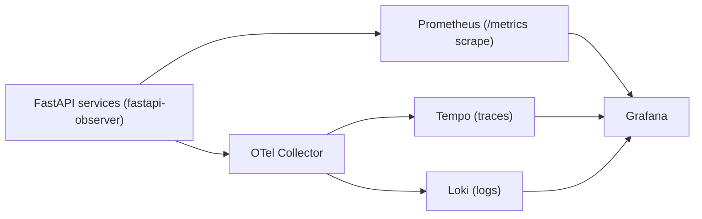
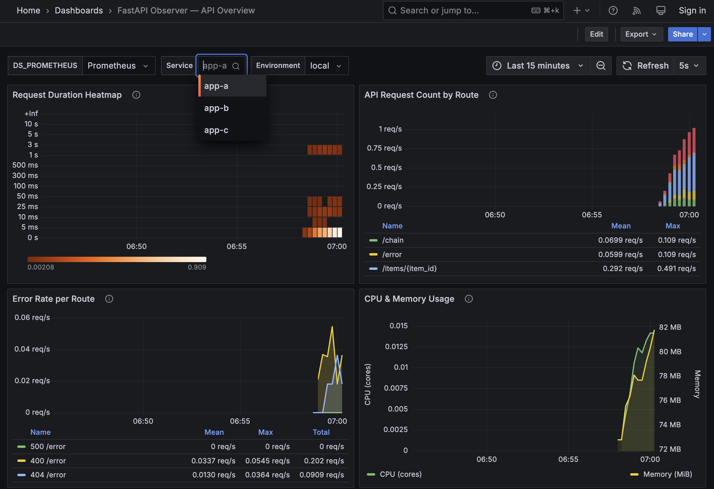
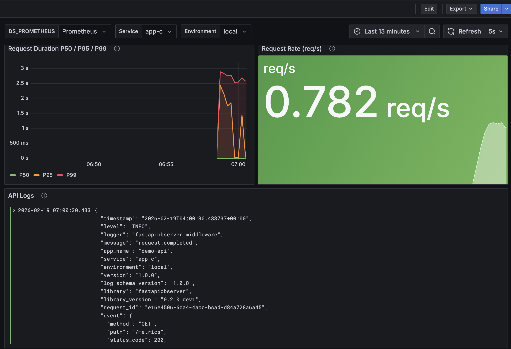

# fastapi-observer

[](https://github.com/Vitaee/FastapiObserver/actions/workflows/ci.yml)
[](https://buymeacoffee.com/FYbPCSu)

**Zero-glue observability for FastAPI.**

`fastapi-observer` gives you structured JSON logs, request correlation, Prometheus metrics, OpenTelemetry tracing, security redaction presets, and runtime controls in one install step and one function call.

**Supported Python versions:** `3.10` to `3.14`

---

## Compatibility Matrix

| Component | Supported / Tested |
|---|---|
| Python | `3.10` to `3.14` (CI matrix) |
| FastAPI | `>=0.129.0` |
| Starlette | `>=0.52.1` |
| pydantic-settings | `>=2.10.1` |
| Prometheus backend | `prometheus-client>=0.24.1` (optional extra) |
| OpenTelemetry | `opentelemetry-api/sdk/exporter>=1.39.1` (optional extra) |
| Loguru bridge | `loguru>=0.7.2` (optional extra) |

---

## Why This Package Exists

Most FastAPI services eventually need the same observability plumbing:
- Structured JSON logging
- Request and trace correlation
- Metrics for dashboards and alerts
- OpenTelemetry setup
- Redaction/sanitization for sensitive data
- Runtime controls for incident response

Teams usually implement this as custom glue code in every service. That costs engineering time and creates drift between services.

`fastapi-observer` replaces this repeated wiring with a consistent, secure-by-default setup.

---

## Sponsor

If this library saves you engineering time, you can support maintenance here:

[buymeacoffee.com/FYbPCSu](https://buymeacoffee.com/FYbPCSu)

---

## What You Get Immediately

After one call to `install_observability()`:

| Capability | Included | Default |
|---|---|---|
| Structured JSON logs | Yes | Enabled |
| Request ID correlation | Yes | Enabled |
| Trace/span IDs in logs | Yes (with OTel) | Off until OTel enabled |
| Prometheus `/metrics` | Yes | Off until `metrics_enabled=True` |
| Sensitive-data redaction | Yes | Enabled |
| Security presets (`strict`, `pci`, `gdpr`) | Yes | Available |
| Runtime control endpoint | Yes | Off until enabled |
| Plugin hooks for enrichment/hooks | Yes | Available |

---

## Install

```bash
# Core (logging + metrics + security)
pip install fastapi-observer

# Prometheus metrics support
pip install "fastapi-observer[prometheus]"

# Loguru coexistence bridge support
pip install "fastapi-observer[loguru]"

# OpenTelemetry tracing/logs support
pip install "fastapi-observer[otel]"

# Everything
pip install "fastapi-observer[all]"
```

Import path:

```python
import fastapiobserver
```

---

## 5-Minute Quick Start

```python
from fastapi import FastAPI
from fastapiobserver import ObservabilitySettings, install_observability

app = FastAPI()

settings = ObservabilitySettings(
    app_name="orders-api",
    service="orders",
    environment="production",
    version="0.1.0",
    metrics_enabled=True,
)

install_observability(app, settings)


@app.get("/orders/{order_id}")
def get_order(order_id: int) -> dict[str, int]:
    return {"order_id": order_id}
```

Run:

```bash
uvicorn main:app --reload
```

Now you have:
- Structured request logs on every request
- Request ID propagation
- Sanitized event payloads
- Prometheus metrics at `/metrics`

---

## Security Defaults and Presets

### Default protections

| Protection | Default | Why |
|---|---|---|
| Body logging | `OFF` | Avoid leaking request/response secrets |
| Sensitive key masking | `ON` | Protect fields like `password`, `token`, `secret` |
| Sensitive header masking | `ON` | Protect `authorization`, `cookie`, `x-api-key` |
| Query string in logged path | Excluded | Prevent accidental token leakage |
| Request ID trust boundary | Trusted CIDRs only | Prevent spoofed correlation IDs |

### Presets for regulated environments

```python
from fastapiobserver import SecurityPolicy

# Strictest option: drop sensitive values and keep minimal safe headers
strict_policy = SecurityPolicy.from_preset("strict")

# PCI-focused redaction fields
pci_policy = SecurityPolicy.from_preset("pci")

# GDPR-focused hashed PII fields
gdpr_policy = SecurityPolicy.from_preset("gdpr")
```

Use a preset in installation:

```python
install_observability(app, settings, security_policy=SecurityPolicy.from_preset("pci"))
```

### Allowlist-only logging (audit-style)

If your compliance model is "log only approved fields", use allowlists:

```python
from fastapiobserver import SecurityPolicy

policy = SecurityPolicy(
    header_allowlist=("x-request-id", "content-type", "user-agent"),
    event_key_allowlist=("method", "path", "status_code"),
)
```

### Body capture media-type guard

```python
policy = SecurityPolicy(
    log_request_body=True,
    body_capture_media_types=("application/json",),
)
```

---

## Runtime Control Plane (No Restart)

Use runtime controls when you need higher log verbosity or different trace sampling during an incident.

```bash
export OBSERVABILITY_CONTROL_TOKEN="replace-me"
```

```python
from fastapiobserver import RuntimeControlSettings, install_observability

runtime_control = RuntimeControlSettings(enabled=True)
install_observability(app, settings, runtime_control_settings=runtime_control)
```

Inspect current runtime values:

```bash
curl -X GET http://localhost:8000/_observability/control \
  -H "Authorization: Bearer replace-me"
```

Update runtime values:

```bash
curl -X POST http://localhost:8000/_observability/control \
  -H "Authorization: Bearer replace-me" \
  -H "Content-Type: application/json" \
  -d '{"log_level":"DEBUG","trace_sampling_ratio":0.25}'
```

What changes immediately:
- Root logger level (and uvicorn loggers)
- Dynamic OTel trace sampling ratio

---

## OpenTelemetry (Traces + Optional OTLP Logs + Optional OTLP Metrics)

```python
from fastapiobserver import (
    OTelLogsSettings,
    OTelMetricsSettings,
    OTelSettings,
    install_observability,
)

otel_settings = OTelSettings(
    enabled=True,
    service_name="orders-api",
    service_version="2.0.0",
    environment="production",
    otlp_endpoint="http://localhost:4317",
    protocol="grpc",                  # or "http/protobuf"
    trace_sampling_ratio=1.0,
    extra_resource_attributes={
        "k8s.namespace": "prod",
        "team": "backend",
    },
)

otel_logs_settings = OTelLogsSettings(
    enabled=True,
    logs_mode="both",                 # "local_json", "otlp", or "both"
    otlp_endpoint="http://localhost:4317",
    protocol="grpc",
)

otel_metrics_settings = OTelMetricsSettings(
    enabled=True,
    otlp_endpoint="http://localhost:4317",
    protocol="grpc",                  # or "http/protobuf"
    export_interval_millis=60000,
)

install_observability(
    app,
    settings,
    otel_settings=otel_settings,
    otel_logs_settings=otel_logs_settings,
    otel_metrics_settings=otel_metrics_settings,
)
```

Design details:
- Reuses an externally configured tracer provider if one already exists.
- Injects trace IDs into application logs for log-trace correlation.
- Supports runtime sampling updates through the control plane.
- Sends OTel logs in OTLP mode with the same sanitization policy.
- Supports optional OTLP metrics export for unified OTel backends.
- Registers graceful shutdown hooks to flush provider buffers on app exit.

### Baggage propagation

`inject_trace_headers()` uses OpenTelemetry propagation, so it forwards
`traceparent`, `tracestate`, and `baggage` when baggage is present in the active context.

```python
from opentelemetry import baggage
from opentelemetry.context import attach, detach

from fastapiobserver import inject_trace_headers

token = attach(baggage.set_baggage("tenant_id", "acme"))
try:
    headers = inject_trace_headers({})
    # headers["baggage"] == "tenant_id=acme"
finally:
    detach(token)
```

---

## What `install_observability()` Wires Up

1. Structured logging pipeline (JSON formatter + bounded async queue handler).
2. Metrics backend and `/metrics` endpoint when metrics are enabled.
3. OTel tracing setup when OTel is enabled.
4. Optional OTel logs/metrics setup when OTLP settings are enabled.
5. Request logging middleware with sanitization and context cleanup.
6. Runtime control endpoint when runtime control is enabled.

Request path lifecycle (high-level):

```text
Request arrives
  -> request ID / trace context resolved
  -> app handler executes
  -> response classified (ok/client_error/server_error/exception)
  -> payload sanitized by policy
  -> log emitted + metrics recorded
  -> context cleared
```

### Internal Package Layout (Contributor Map)

The project is now organized as focused subpackages instead of large monolithic modules:

- `fastapiobserver/logging/`: formatter, queueing, filters, setup lifecycle, sink circuit-breakers.
- `fastapiobserver/middleware/`: request logging orchestration, context, IP resolution, headers, body capture, metrics hooks.
- `fastapiobserver/sinks/`: sink protocol, registry/discovery, built-ins, factory wiring, Logtail + DLQ implementation.
- `fastapiobserver/metrics/`: backend contracts/registry/builder/endpoint, Prometheus integration subpackage.
- `fastapiobserver/security/`: policy/settings models, normalization helpers, redaction engine, trusted-proxy utilities.
- `fastapiobserver/otel/`: OTel settings/resource/tracing/logs/metrics/lifecycle helpers.

Public imports remain backward-compatible via package facades (`__init__.py` re-exports).

---

## Example JSON Log Event

```json
{
  "timestamp": "2026-02-18T10:30:00.000000+00:00",
  "level": "INFO",
  "logger": "fastapiobserver.middleware",
  "message": "request.completed",
  "app_name": "orders-api",
  "service": "orders",
  "environment": "production",
  "version": "0.1.0",
  "log_schema_version": "1.0.0",
  "library": "fastapiobserver",
  "request_id": "a1b2c3d4-e5f6-7890-abcd-ef1234567890",
  "trace_id": "0af7651916cd43dd8448eb211c80319c",
  "span_id": "b7ad6b7169203331",
  "event": {
    "method": "GET",
    "path": "/orders/42",
    "status_code": 200,
    "http.request.method": "GET",
    "url.path": "/orders/42",
    "http.response.status_code": 200,
    "duration_ms": 3.456,
    "client_ip": "10.0.0.1",
    "error_type": "ok"
  }
}
```

On exception logs, a structured `error` object is included for indexed queries, featuring a stable AST-based `fingerprint` hash which ignores transient memory locations or exact line numbers, allowing zero-dependency alerting directly in your search backend.

```json
{
  "error": {
    "type": "RuntimeError",
    "message": "boom",
    "stacktrace": "Traceback (most recent call last): ...",
    "fingerprint": "a1b2c3d4e5f67890abcd12345678bbcc"
  }
}
```

---

## Production Deployment Guide

This section is deployment-first. A new engineer should be able to ship this stack without reading the source code.

### Reference architecture



### Minimal collector config

```yaml
receivers:
  otlp:
    protocols:
      grpc:
        endpoint: 0.0.0.0:4317
      http:
        endpoint: 0.0.0.0:4318

processors:
  memory_limiter:
    limit_mib: 512
    spike_limit_mib: 128
    check_interval: 5s
  batch:
    send_batch_size: 512
    timeout: 5s

exporters:
  otlphttp/tempo:
    endpoint: http://tempo:4318
  otlphttp/loki:
    endpoint: http://loki:3100/otlp

service:
  pipelines:
    traces:
      receivers: [otlp]
      processors: [memory_limiter, batch]
      exporters: [otlphttp/tempo]
    logs:
      receivers: [otlp]
      processors: [memory_limiter, batch]
      exporters: [otlphttp/loki]
```

### Rollout strategy

1. Baseline current service SLOs before migration (`latency`, `error rate`, `availability`).
2. Enable `fastapi-observer` in one service with conservative settings (no body capture).
3. Run canary rollout (5-10% traffic) and compare:
   latency p95, 5xx rate, and log/traces pipeline health.
4. Expand rollout to all replicas/services after 24-48h stable canary.
5. Enable advanced controls in phases:
   security presets, allowlists, runtime control plane, OTLP logs mode.

### Failure modes and expected behavior

| Failure mode | Expected behavior | Immediate action |
|---|---|---|
| OTel Collector down | App still serves traffic; local logs still available if `OTEL_LOGS_MODE=both` | Fail over Collector or temporarily switch to local-json mode |
| Tempo down | Traces unavailable; logs/metrics continue | Restore Tempo, keep incident correlation via logs |
| Loki down | Logs unavailable in Grafana; metrics/traces continue | Restore Loki, use app stdout logs temporarily |
| Prometheus down | No metrics/alerts; app traffic unaffected | Restore Prometheus and alertmanager path |
| High cardinality on paths | Prometheus pressure increases | Use route templates and exclude noisy paths |
| Spoofed forwarded headers | Incorrect client IP/request ID trust | Tighten `OBS_TRUSTED_CIDRS` and proxy chain config |

### SLO and alert checklist

Recommended SLOs:
- Availability: `>= 99.9%` over 30 days
- p95 latency: `< 500ms` for core APIs
- 5xx rate: `< 1%` per service
- Error-budget burn alerting: fast burn (1h), slow burn (6h)

Starter alert queries:

```promql
# 5xx rate per service (5 minutes)
sum(rate(http_requests_total{status_code=~"5.."}[5m])) by (service)

# p95 latency per service
histogram_quantile(
  0.95,
  sum(rate(http_request_duration_seconds_bucket[5m])) by (le, service)
)

# Traffic drop detection
sum(rate(http_requests_total[5m])) by (service)
```

### Incident playbook (first 15 minutes)

1. Confirm blast radius in Grafana:
   affected services, status codes, latency shifts, deployment changes.
2. Increase signal quality without restart:
   use runtime control plane to raise log level and tracing sample ratio.
3. Identify dependency failures:
   check Collector, Loki, Tempo, Prometheus health and ingestion queues.
4. Mitigate:
   roll back latest app change, scale affected service, or disable expensive capture options.
5. Verify recovery:
   p95 + 5xx return to baseline, trace volume normalized, alert clears.

### Kubernetes quickstart (copy/paste)

Use the bundled manifests:

```bash
kubectl kustomize --load-restrictor=LoadRestrictionsNone examples/k8s | kubectl apply -f -
kubectl -n observability rollout status deployment/app-a
kubectl -n observability rollout status deployment/app-b
kubectl -n observability rollout status deployment/app-c
kubectl -n observability rollout status deployment/otel-collector
kubectl -n observability rollout status deployment/prometheus
kubectl -n observability rollout status deployment/loki
kubectl -n observability rollout status deployment/tempo
kubectl -n observability rollout status deployment/grafana
kubectl -n observability rollout status deployment/traffic-generator
kubectl -n observability port-forward svc/grafana 3000:3000
```

Open [http://localhost:3000](http://localhost:3000).
Full guide: [`kubernetes.md`](kubernetes.md)

---

## Low-Overhead & Production Tuning (Advanced)

`fastapi-observer` integrates natively with the core OpenTelemetry Python SDK, meaning you can aggressively tune its resource usage purely via standard environment variables without altering your application code.

For high-throughput services (e.g. `10k+ RPS`), apply these exact variables to minimize the observer footprint:

### 1. Head-Based Sampling

Tracing 100% of requests is too expensive at scale. You should configure `fastapi-observer` to respect upstream trace flags, while only sampling a fraction of net-new requests:

```bash
# Keep the parent's sample decision if it exists, otherwise sample 5%
export OTEL_TRACES_SAMPLER="parentbased_traceidratio"
export OTEL_TRACES_SAMPLER_ARG="0.05"
```

### 2. Exclude Noisy URLs from the SDK

Do not waste cycles generating spans for health checks or static assets. `fastapi-observer` will auto-derive metrics exclusions, but you can explicitly drop them from tracing at the C-extension level:

```bash
export OTEL_PYTHON_FASTAPI_EXCLUDED_URLS="healthz,metrics,favicon.ico"
```

### 3. Cap Span Attributes

Prevent large, unmanageable spans from consuming excessive memory in the `BatchSpanProcessor`:

```bash
export OTEL_SPAN_ATTRIBUTE_COUNT_LIMIT="128"
export OTEL_SPAN_EVENT_COUNT_LIMIT="128"
export OTEL_SPAN_LINK_COUNT_LIMIT="128"
```

### 4. Optimize Output Buffers

The default OpenTelemetry batch limits are too conservative for high-throughput ASGI microservices. Increase the max queue limits so spikes aren't dropped, but decrease the timeout so the process memory is flushed faster:

```bash
export OTEL_BSP_MAX_QUEUE_SIZE="10000"
export OTEL_BSP_MAX_EXPORT_BATCH_SIZE="5000"
export OTEL_BSP_SCHEDULE_DELAY="1000"
```

---

## Examples

The `examples/` directory contains runnable demos:

| Example | What it shows |
|---|---|
| [`basic_app.py`](examples/basic_app.py) | Minimal setup and request logging |
| [`security_presets_app.py`](examples/security_presets_app.py) | Preset-based security policy |
| [`allowlist_app.py`](examples/allowlist_app.py) | Allowlist-only sanitization |
| [`otel_app.py`](examples/otel_app.py) | OTel tracing and resource attributes |
| [`graphql_app.py`](examples/graphql_app.py) | Native Strawberry GraphQL observability |
| [`benchmarks/`](examples/benchmarks/) | Baseline vs observer benchmark harness |
| [`k8s/`](examples/k8s/) | Kubernetes-native stack with Prometheus + Loki + Tempo + Grafana |
| [`full_stack/`](examples/full_stack/) | **Docker Compose stack**: 3 FastAPI services + Grafana + Prometheus + Loki + Tempo |

Run an example:

```bash
uvicorn examples.basic_app:app --reload
```

### Dashboard Screenshots (Full-Stack Demo)

From `examples/full_stack`, these are real Grafana views generated by `fastapi-observer` telemetry:

**Overview panels (latency heatmap, route throughput, errors, CPU/memory):**



**Percentiles, request rate, and structured JSON logs in Loki:**



---

## Environment Variables

The library supports configuration from code and env vars. Below are the most relevant env vars by area.

### Identity and logging

| Variable | Default | Description |
|---|---|---|
| `APP_NAME` | `app` | Namespace for app-level identity |
| `SERVICE_NAME` | `api` | Service label for logs/metrics |
| `ENVIRONMENT` | `development` | Environment label |
| `APP_VERSION` | `0.0.0` | Service version |
| `LOG_LEVEL` | `INFO` | Root log level |
| `LOG_DIR` | - | Optional file log directory |
| `LOG_QUEUE_MAX_SIZE` | `10000` | Max in-memory records in core log queue |
| `LOG_QUEUE_OVERFLOW_POLICY` | `drop_oldest` | Queue overflow behavior: `drop_oldest`, `drop_newest`, `block` |
| `LOG_QUEUE_BLOCK_TIMEOUT_SECONDS` | `1.0` | Timeout used by `block` policy before dropping newest |
| `LOG_SINK_CIRCUIT_BREAKER_ENABLED` | `true` | Enable sink circuit-breaker protection |
| `LOG_SINK_CIRCUIT_BREAKER_FAILURE_THRESHOLD` | `5` | Consecutive sink failures before opening circuit |
| `LOG_SINK_CIRCUIT_BREAKER_RECOVERY_TIMEOUT_SECONDS` | `30.0` | Open-state cooldown before half-open probe |
| `REQUEST_ID_HEADER` | `x-request-id` | Incoming request ID header |
| `RESPONSE_REQUEST_ID_HEADER` | `x-request-id` | Response request ID header |

### Metrics

| Variable | Default | Description |
|---|---|---|
| `METRICS_ENABLED` | `false` | Enable metrics backend |
| `METRICS_BACKEND` | `prometheus` | Registered backend name used by `install_observability()` |
| `METRICS_PATH` | `/metrics` | Metrics endpoint path |
| `METRICS_EXCLUDE_PATHS` | `/metrics,/health,/healthz,/docs,/openapi.json` | Skip metrics for noisy endpoints |
| `METRICS_EXEMPLARS_ENABLED` | `false` | Enable exemplars where supported |
| `METRICS_FORMAT` | `negotiate` | `prometheus`, `openmetrics`, or `negotiate` |

> [!CAUTION]
> The `/metrics` endpoint is **unauthenticated by default**. In production it should be restricted to internal networks (e.g. behind a Kubernetes `NetworkPolicy`, VPC security group, or ingress rule that only allows your Prometheus scraper). Exposing it publicly leaks service topology, error rates, and request patterns.

### Security and trust boundary

| Variable | Default | Description |
|---|---|---|
| `OBS_REDACTION_PRESET` | - | `strict`, `pci`, `gdpr` |
| `OBS_REDACTED_FIELDS` | built-in list | CSV keys to redact |
| `OBS_REDACTED_HEADERS` | built-in list | CSV headers to redact |
| `OBS_REDACTION_MODE` | `mask` | `mask`, `hash`, `drop` |
| `OBS_MASK_TEXT` | `***` | Mask replacement text |
| `OBS_LOG_REQUEST_BODY` | `false` | Enable request body logging |
| `OBS_LOG_RESPONSE_BODY` | `false` | Enable response body logging |
| `OBS_MAX_BODY_LENGTH` | `256` | Max captured body bytes |
| `OBS_HEADER_ALLOWLIST` | - | CSV headers allowed in logs |
| `OBS_EVENT_KEY_ALLOWLIST` | - | CSV event keys allowed in logs |
| `OBS_BODY_CAPTURE_MEDIA_TYPES` | - | CSV allowed media types for body capture |
| `OBS_TRUSTED_PROXY_ENABLED` | `true` | Enable trusted-proxy policy |
| `OBS_TRUSTED_CIDRS` | RFC1918 + loopback | CSV trusted CIDRs |
| `OBS_HONOR_FORWARDED_HEADERS` | `false` | Trust forwarded headers |

Notes:
- `OBS_HEADER_ALLOWLIST`, `OBS_EVENT_KEY_ALLOWLIST`, and `OBS_BODY_CAPTURE_MEDIA_TYPES` accept `none`, `null`, or `unset` to clear values.

### OpenTelemetry tracing/log export

| Variable | Default | Description |
|---|---|---|
| `OTEL_ENABLED` | `false` | Enable tracing instrumentation |
| `OTEL_SERVICE_NAME` | `SERVICE_NAME` | OTel service name override |
| `OTEL_SERVICE_VERSION` | `APP_VERSION` | OTel service version override |
| `OTEL_ENVIRONMENT` | `ENVIRONMENT` | OTel environment override |
| `OTEL_EXPORTER_OTLP_ENDPOINT` | - | OTLP endpoint |
| `OTEL_EXPORTER_OTLP_PROTOCOL` | `grpc` | `grpc` or `http/protobuf` |
| `OTEL_TRACE_SAMPLING_RATIO` | `1.0` | Initial trace sampling ratio |
| `OTEL_EXTRA_RESOURCE_ATTRIBUTES` | - | CSV `key=value` pairs |
| `OTEL_EXCLUDED_URLS` | auto-derived | CSV excluded paths for tracing |
| `OTEL_LOGS_ENABLED` | `false` | Enable OTLP log export |
| `OTEL_LOGS_MODE` | `local_json` | `local_json`, `otlp`, `both` |
| `OTEL_LOGS_ENDPOINT` | - | OTLP logs endpoint |
| `OTEL_LOGS_PROTOCOL` | `grpc` | `grpc` or `http/protobuf` |
| `OTEL_METRICS_ENABLED` | `false` | Enable OTLP metrics export |
| `OTEL_METRICS_ENDPOINT` | - | OTLP metrics endpoint |
| `OTEL_METRICS_PROTOCOL` | `grpc` | `grpc` or `http/protobuf` |
| `OTEL_METRICS_EXPORT_INTERVAL_MILLIS` | `60000` | OTLP metrics export interval in milliseconds |

### Runtime control plane

| Variable | Default | Description |
|---|---|---|
| `OBS_RUNTIME_CONTROL_ENABLED` | `false` | Enable runtime control endpoint |
| `OBS_RUNTIME_CONTROL_PATH` | `/_observability/control` | Control endpoint path |
| `OBS_RUNTIME_CONTROL_TOKEN_ENV_VAR` | `OBSERVABILITY_CONTROL_TOKEN` | Name of env var containing bearer token |
| `OBSERVABILITY_CONTROL_TOKEN` | - | Bearer token value used for auth |

### Optional Logtail sink

| Variable | Default | Description |
|---|---|---|
| `LOGTAIL_ENABLED` | `false` | Enable Better Stack Logtail sink |
| `LOGTAIL_SOURCE_TOKEN` | - | Logtail source token |
| `LOGTAIL_BATCH_SIZE` | `50` | Batch size for shipping |
| `LOGTAIL_FLUSH_INTERVAL` | `2.0` | Flush interval (seconds) |
| `LOGTAIL_DLQ_ENABLED` | `false` | Enable resilient local disk fallback for dropped logs |
| `LOGTAIL_DLQ_DIR` | `.dlq/logtail` | Directory to archive dropped NDJSON messages |
| `LOGTAIL_DLQ_MAX_BYTES` | `52428800` | Max bytes per DLQ file before rotation (50MB) |
| `LOGTAIL_DLQ_COMPRESS` | `true` | GZIP compress rotated DLQ files |

> [!TIP]
> The Logtail Dead Letter Queue (DLQ) provides best-effort local durability. If the internal memory queue overflows under immense API pressure (`queue.Full`), or if an external network partition completely exhausts the outbound HTTP retry backoff, the dropped log payloads are immediately salvaged into local NDJSON envelopes. You can replay these files to BetterStack later using the provided `scripts/replay_dlq.py` utility.

### Tamper-evident audit logging

For regulated industries (Fintech, Healthcare, SOC 2) where you must prove logs were not altered, deleted, or reordered:

```bash
pip install "fastapi-observer[audit]"
export OBS_AUDIT_SECRET_KEY="your-signing-secret"
export OBS_AUDIT_LOGGING_ENABLED="true"
```

```python
install_observability(app, settings)
# Every JSON log now contains _audit_seq and _audit_sig fields
```

Each log record is chained via HMAC-SHA256: record B's signature includes the signature of record A. Breaking any link (tamper, delete, reorder) invalidates the chain.

| Variable | Default | Description |
|---|---|---|
| `OBS_AUDIT_LOGGING_ENABLED` | `false` | Enable HMAC-SHA256 hash chain |
| `OBS_AUDIT_KEY_ENV_VAR` | `OBS_AUDIT_SECRET_KEY` | Name of env var containing the signing key |
| `OBS_AUDIT_SECRET_KEY` | - | The HMAC signing key (read by `LocalHMACProvider`) |

Custom key provider (e.g. KMS / Vault):

```python
from fastapiobserver import AuditKeyProvider

class VaultKeyProvider:
    def get_key(self) -> bytes:
        return vault_client.get_secret("audit-signing-key").encode()

install_observability(app, settings, audit_key_provider=VaultKeyProvider())
```

Verify logs with the CLI:

```bash
export OBS_AUDIT_SECRET_KEY="your-signing-secret"
python scripts/verify_audit_chain.py exported_logs.ndjson
# PASS — 1042 records verified, chain intact.
```

---

## Advanced Operations

### Middleware ordering for body capture

If body capture is enabled, install observability before other middleware:

```python
from fastapi.middleware.cors import CORSMiddleware
from fastapiobserver import SecurityPolicy, install_observability

install_observability(app, settings, security_policy=SecurityPolicy(log_request_body=True))
app.add_middleware(CORSMiddleware, allow_origins=["*"])
```

### Multi-worker Gunicorn

> [!WARNING]
> `--preload-app` is dangerous if visibility is initialized at the module level.
>
> When `--preload-app` is used, the application is loaded into the master process *before* forking the worker processes. `fastapi-observer` uses a highly-performant background thread (`QueueListener`) for non-blocking logging, and OpenTelemetry similarly spawns background export threads.
>
> Threads **do not survive** a process fork. If you call `install_observability()` at the module level (e.g., right under `app = FastAPI()`), the background threads will be created in the master process, and all workers will silently drop logs because their logging threads never started.
>
> **How to fix:** Either remove `--preload-app`, OR initialize observability inside the FastAPI `lifespan` context manager so it starts safely after the fork inside each worker:
>
> ```python
> from contextlib import asynccontextmanager
> from fastapi import FastAPI
> from fastapiobserver import ObservabilitySettings, install_observability
>
> settings = ObservabilitySettings(service="api")
>
> @asynccontextmanager
> async def lifespan(app: FastAPI):
>     install_observability(app, settings) # Safely initializes per-worker
>     yield
>     # fastapiobserver automatically registers shutdown hooks so no teardown needed here
>
> app = FastAPI(lifespan=lifespan)
> ```

#### Prometheus Multiprocess Mode

If you are using Prometheus with multiple Gunicorn workers, you must configure a shared metrics directory:

```bash
export PROMETHEUS_MULTIPROC_DIR=/tmp/prometheus-metrics
rm -rf "$PROMETHEUS_MULTIPROC_DIR"
mkdir -p "$PROMETHEUS_MULTIPROC_DIR"
```

`gunicorn.conf.py`:

```python
from fastapiobserver import mark_prometheus_process_dead


def child_exit(server, worker):
    mark_prometheus_process_dead(worker.pid)
```

### Bounded queue and overflow policy

Use queue controls to define behavior under sustained log pressure:

```python
settings = ObservabilitySettings(
    app_name="orders-api",
    service="orders",
    environment="production",
    log_queue_max_size=20000,
    log_queue_overflow_policy="drop_oldest",  # or "drop_newest" / "block"
    log_queue_block_timeout_seconds=0.5,
)
```

Queue pressure metrics exposed on `/metrics` (Prometheus mode):
- `fastapiobserver_log_queue_size`
- `fastapiobserver_log_queue_capacity`
- `fastapiobserver_log_queue_enqueued_total`
- `fastapiobserver_log_queue_dropped_total{reason="drop_oldest|drop_newest"}`
- `fastapiobserver_log_queue_blocked_total`
- `fastapiobserver_log_queue_block_timeouts_total`

### Sink circuit breaker

Every output sink is wrapped with a circuit breaker so a failing sink does not
degrade request-path logging. This includes custom sinks registered via the
`LogSink` protocol.
The core package stays intentionally lean; provider-specific sinks can be added
as optional packages without changing `install_observability()`.

```python
settings = ObservabilitySettings(
    app_name="orders-api",
    service="orders",
    environment="production",
    sink_circuit_breaker_enabled=True,
    sink_circuit_breaker_failure_threshold=5,
    sink_circuit_breaker_recovery_timeout_seconds=30.0,
)
```

Breaker metrics exposed on `/metrics`:
- `fastapiobserver_sink_circuit_breaker_state_info{sink,state}`
- `fastapiobserver_sink_circuit_breaker_failures_total{sink}`
- `fastapiobserver_sink_circuit_breaker_skipped_total{sink}`
- `fastapiobserver_sink_circuit_breaker_opens_total{sink}`
- `fastapiobserver_sink_circuit_breaker_half_open_total{sink}`
- `fastapiobserver_sink_circuit_breaker_closes_total{sink}`

### Logging Shutdown Lifecycle

`install_observability()` now registers graceful logging teardown on FastAPI
shutdown and also uses an `atexit` fallback. This reduces lost log records
during process termination.

If you embed logging setup outside FastAPI lifecycle management, you can stop
the queue pipeline explicitly:

```python
from fastapiobserver import shutdown_logging

shutdown_logging()
```

### Loguru Coexistence

If your service already uses `loguru`, forward those logs into
`fastapi-observer` instead of maintaining two independent pipelines.

```python
from fastapiobserver import install_loguru_bridge

# loguru -> stdlib -> fastapi-observer queue/sinks
bridge_id = install_loguru_bridge()
```

Detailed migration/coexistence guide: [`loguru.md`](loguru.md)

---

## GraphQL Integrations (Strawberry)

If you use `strawberry-graphql`, routing all traffic through `POST /graphql` severely blinds your logs and traces.
`fastapi-observer` ships a native Strawberry extension (via Duck Typing, meaning NO bloated pip dependencies) to automatically extract GraphQL operations.

```python
import strawberry
from fastapiobserver.integrations.strawberry import StrawberryObservabilityExtension

@strawberry.type
class Query:
    @strawberry.field
    def hello(self) -> str:
        return "world"

schema = strawberry.Schema(
    query=Query,
    extensions=[StrawberryObservabilityExtension],  # Inject this!
)
```

With this extension, your logs will automatically get a `graphql` context key containing the extracted `operation_name`:
```json
{
  "event": {
    "method": "POST",
    "path": "/graphql"
  },
  "user_context": {
    "graphql": {
      "operation_name": "GetUsersQuery"
    }
  }
}
```
If OpenTelemetry is enabled, your traces will dynamically rename from `POST /graphql` to `graphql.operation.GetUsersQuery`.

---

## Plugin Hooks

Extend behavior without editing package internals:

```python
from fastapiobserver import (
    register_log_enricher,
    register_log_filter,
    register_metric_hook,
)


def add_git_sha(payload: dict) -> dict:
    payload["git_sha"] = "abc123"
    return payload


def drop_health_probe(record) -> bool:
    return "health" not in record.getMessage().lower()


def track_slow_requests(request, response, duration):
    if duration > 1.0:
        print(f"slow request: {request.url.path} {duration:.2f}s")


register_log_enricher("git_sha", add_git_sha)
register_log_filter("drop_health_probe", drop_health_probe)
register_metric_hook("slow_requests", track_slow_requests)
```

Plugin failures are isolated and do not crash request handling.

### Custom Metrics Backend Registry

Use `register_metrics_backend()` to plug in non-Prometheus backends without
modifying core code:

```python
from fastapiobserver import register_metrics_backend


class MyBackend:
    def observe(self, method, path, status_code, duration_seconds):
        ...

    def mount_endpoint(self, app, *, path="/metrics", metrics_format="negotiate"):
        # Optional: mount a backend-specific endpoint
        ...


def build_my_backend(*, service: str, environment: str, exemplars_enabled: bool):
    return MyBackend()


register_metrics_backend("my_backend", build_my_backend)
```

### Formatter Dependency Injection

`StructuredJsonFormatter` accepts injectable callables for enrichment and
sanitization, keeping defaults unchanged while improving testability:

```python
formatter = StructuredJsonFormatter(
    settings,
    enrich_event=my_enricher,
    sanitize_payload=my_sanitizer,
)
```

---

## OTel Test Coverage

Repository integration tests include:
- `tests/test_otel_log_correlation.py`: verifies trace/span IDs in logs map to real spans.
- `tests/test_otlp_export_integration.py`: validates OTLP HTTP export with local collector fixtures.

---

## Benchmarking

Reproducible benchmark harness and methodology:
- Guide: [`benchmarks.md`](benchmarks.md)
- Apps: `examples/benchmarks/app.py`
- Runner: `examples/benchmarks/harness.py`

---

## Release Tracks

- `0.1.x`: secure-by-default core
- `0.2.x`: OTel interoperability, security presets, allowlists
- `0.3.x`: GraphQL observability, error fingerprinting, and Logtail DLQ durability
- `0.4.x`: package modularization, sink/registry hardening, and runtime control token rotation
- `1.0.0`: first stable release contract for production deployments

Current release version: `1.0.0`

## Changelog Policy

Breaking changes must be listed under a `Breaking Changes` section in `CHANGELOG.md`.

---

## Packaging and Publishing (Maintainers)

Recommended release command (uses `.env` with `PYPI_TOKEN`):

```bash
scripts/deploy_pypi.sh --tag v1.0.0 --push-tag
```

### 1) Build distributions

```bash
python -m pip install --upgrade pip build
python -m build
```

### 2) Upload to TestPyPI

```bash
python -m pip install --upgrade twine
python -m twine upload --repository testpypi dist/*
```

### 3) Validate install from TestPyPI

```bash
python -m pip install \
  --extra-index-url https://test.pypi.org/simple/ \
  fastapi-observer
```

### 4) Upload to production PyPI

```bash
python -m twine upload dist/*
```

---

## Local Git Hook (Recommended)

```bash
git config core.hooksPath .githooks
```

The pre-push hook runs:
- `uv run ruff check`
- `uv run mypy src`
- `uv run pytest -q`

---

## Roadmap Tracking

See [NEXT_STEPS.md](NEXT_STEPS.md) for the active roadmap and release checklist.
