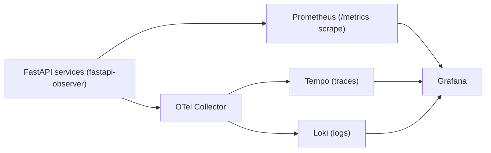

# Production Deployment Guide

This section is deployment-first. A new engineer should be able to ship this stack without reading the source code.

### Reference architecture



### Minimal collector config

```yaml
receivers:
  otlp:
    protocols:
      grpc:
        endpoint: 0.0.0.0:4317
      http:
        endpoint: 0.0.0.0:4318

processors:
  memory_limiter:
    limit_mib: 512
    spike_limit_mib: 128
    check_interval: 5s
  batch:
    send_batch_size: 512
    timeout: 5s

exporters:
  otlphttp/tempo:
    endpoint: http://tempo:4318
  otlphttp/loki:
    endpoint: http://loki:3100/otlp

service:
  pipelines:
    traces:
      receivers: [otlp]
      processors: [memory_limiter, batch]
      exporters: [otlphttp/tempo]
    logs:
      receivers: [otlp]
      processors: [memory_limiter, batch]
      exporters: [otlphttp/loki]
```

### Rollout strategy

1. Baseline current service SLOs before migration (`latency`, `error rate`, `availability`).
2. Enable `fastapi-observer` in one service with conservative settings (no body capture).
3. Run canary rollout (5-10% traffic) and compare:
   latency p95, 5xx rate, and log/traces pipeline health.
4. Expand rollout to all replicas/services after 24-48h stable canary.
5. Enable advanced controls in phases:
   security presets, allowlists, runtime control plane, OTLP logs mode.

### Failure modes and expected behavior

| Failure mode | Expected behavior | Immediate action |
|---|---|---|
| OTel Collector down | App still serves traffic; local logs still available if `OTEL_LOGS_MODE=both` | Fail over Collector or temporarily switch to local-json mode |
| Tempo down | Traces unavailable; logs/metrics continue | Restore Tempo, keep incident correlation via logs |
| Loki down | Logs unavailable in Grafana; metrics/traces continue | Restore Loki, use app stdout logs temporarily |
| Prometheus down | No metrics/alerts; app traffic unaffected | Restore Prometheus and alertmanager path |
| High cardinality on paths | Prometheus pressure increases | Use route templates and exclude noisy paths |
| Spoofed forwarded headers | Incorrect client IP/request ID trust | Tighten `OBS_TRUSTED_CIDRS` and proxy chain config |

### SLO and alert checklist

Recommended SLOs:
- Availability: `>= 99.9%` over 30 days
- p95 latency: `< 500ms` for core APIs
- 5xx rate: `< 1%` per service
- Error-budget burn alerting: fast burn (1h), slow burn (6h)

Starter alert queries:

```promql
# 5xx rate per service (5 minutes)
sum(rate(http_requests_total{status_code=~"5.."}[5m])) by (service)

# p95 latency per service
histogram_quantile(
  0.95,
  sum(rate(http_request_duration_seconds_bucket[5m])) by (le, service)
)

# Traffic drop detection
sum(rate(http_requests_total[5m])) by (service)
```

### Incident playbook (first 15 minutes)

1. Confirm blast radius in Grafana:
   affected services, status codes, latency shifts, deployment changes.
2. Increase signal quality without restart:
   use runtime control plane to raise log level and tracing sample ratio.
3. Identify dependency failures:
   check Collector, Loki, Tempo, Prometheus health and ingestion queues.
4. Mitigate:
   roll back latest app change, scale affected service, or disable expensive capture options.
5. Verify recovery:
   p95 + 5xx return to baseline, trace volume normalized, alert clears.

### Kubernetes quickstart (copy/paste)

Use the bundled manifests:

```bash
kubectl kustomize --load-restrictor=LoadRestrictionsNone examples/k8s | kubectl apply -f -
kubectl -n observability rollout status deployment/app-a
kubectl -n observability rollout status deployment/app-b
kubectl -n observability rollout status deployment/app-c
kubectl -n observability rollout status deployment/otel-collector
kubectl -n observability rollout status deployment/prometheus
kubectl -n observability rollout status deployment/loki
kubectl -n observability rollout status deployment/tempo
kubectl -n observability rollout status deployment/grafana
kubectl -n observability rollout status deployment/traffic-generator
kubectl -n observability port-forward svc/grafana 3000:3000
```

Open [http://localhost:3000](http://localhost:3000).
Full guide: [`kubernetes.md`](kubernetes.md)

---

