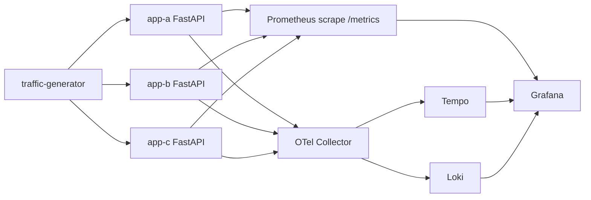

# Kubernetes Deployment Guide (FastAPI Observer)

This guide deploys a complete observability stack to Kubernetes using only:

```bash
kubectl kustomize --load-restrictor=LoadRestrictionsNone examples/k8s | kubectl apply -f -
```

Why this command: the k8s example reuses the dashboard JSON from `examples/full_stack/...`, which is outside the `examples/k8s` folder. `LoadRestrictionsNone` allows that shared-file reference.

After deployment, Grafana will show:
- Metrics from Prometheus (`/metrics` scraped from `app-a`, `app-b`, `app-c`)
- Structured logs from Loki (via OTel Collector OTLP pipeline)
- Traces in Tempo (including cross-service `/chain` requests)

## Architecture



## Prerequisites

- Kubernetes cluster (`v1.26+` recommended)
- `kubectl` configured for your cluster
- Outbound internet access for pulling container images

## Deploy

```bash
kubectl kustomize --load-restrictor=LoadRestrictionsNone examples/k8s | kubectl apply -f -
```

Wait for all Deployments:

```bash
kubectl -n observability rollout status deployment/app-a
kubectl -n observability rollout status deployment/app-b
kubectl -n observability rollout status deployment/app-c
kubectl -n observability rollout status deployment/otel-collector
kubectl -n observability rollout status deployment/prometheus
kubectl -n observability rollout status deployment/loki
kubectl -n observability rollout status deployment/tempo
kubectl -n observability rollout status deployment/grafana
kubectl -n observability rollout status deployment/traffic-generator
```

## Access Grafana and Validate Signals

Port-forward Grafana:

```bash
kubectl -n observability port-forward svc/grafana 3000:3000
```

Open [http://localhost:3000](http://localhost:3000).

Expected dashboard behavior:
- Dashboard: `FastAPI Observer — API Overview`
- Variable `service`: switch between `app-a`, `app-b`, `app-c`
- Variable `environment`: switch to `k8s` (dashboard default in the shared JSON is `local`)
- Panels should populate within 1-2 minutes:
  - Request rate by path
  - P95 latency
  - 5xx rate
  - API logs from Loki

Trace verification:
1. In Grafana, open **Explore -> Tempo**.
2. Query `service.name = app-a`.
3. Pick traces containing `/chain` spans to verify cross-service propagation.

## Optional: Port-forward Other Components

```bash
kubectl -n observability port-forward svc/prometheus 9090:9090
kubectl -n observability port-forward svc/loki 3100:3100
kubectl -n observability port-forward svc/tempo 3200:3200
```

## Key Production Notes

This example is intentionally zero-glue and demo-first. For production:
- Build and pin your own app image instead of runtime `pip install` in the app Pods.
- Add persistent volumes for Loki/Tempo/Prometheus.
- Add auth/TLS for Grafana and telemetry backends.
- Set resource requests/limits according to real traffic.
- Add PodDisruptionBudgets and anti-affinity for HA.

## Cleanup

```bash
kubectl kustomize --load-restrictor=LoadRestrictionsNone examples/k8s | kubectl delete -f -
```
